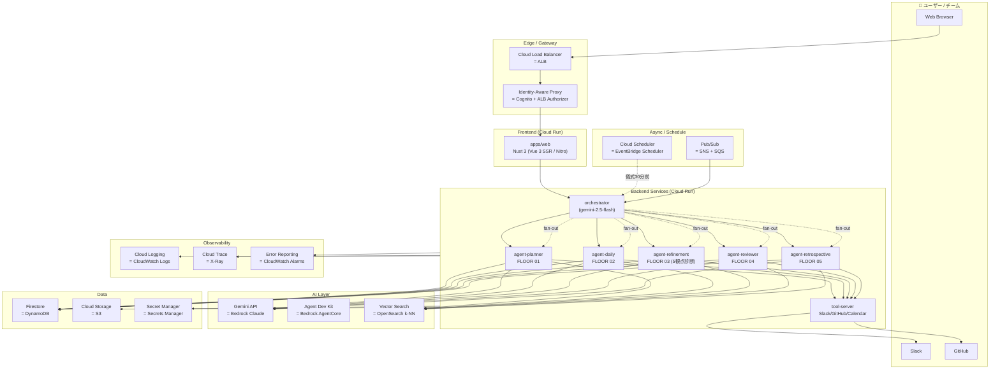
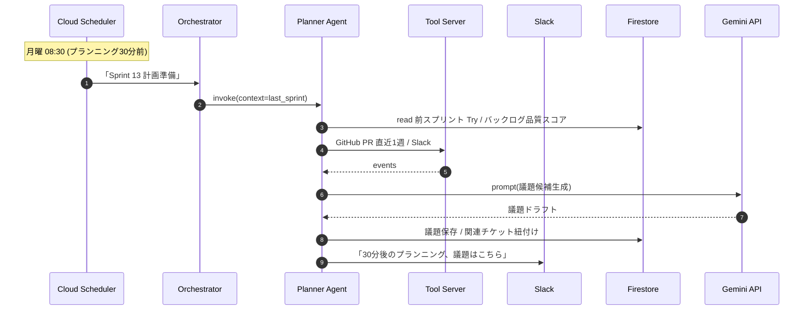

# Belvedere — Architecture

> ハッカソン必須要件: GCP実行プロダクト ≥ 1 / GCP AI技術 ≥ 1
> ユーザーはAWS実務経験あり / GCP未経験 → **GCP↔AWS の対応サービスを必ず併記**

---

## 0. 結論 (採用案)

**「Cloud Run + Gemini API + Firestore + Pub/Sub」のサーバーレス構成**を採用する。

理由:
- 必須要件 (Cloud Run + Gemini) を最小コストで満たす
- AWS Lambda / DynamoDB / SNS+SQS の感覚に近く、ユーザーが認知マッピングしやすい
- 個人参加でも回せる運用コスト
- ハッカソン審査基準⑤「拡張性・実運用への配慮」を満たす最小構成

代替案 B (GKE) / C (App Engine + Cloud Functions) は§4で比較。

---

## 1. 全体図



---

## 2. GCP↔AWS 対応表 (ユーザー向けチートシート)

| 役割 | GCP (採用) | AWS (既知) | 補足 |
|---|---|---|---|
| **コンテナ実行** | Cloud Run | Fargate / App Runner | Cloud RunはApp Runnerに最も近い。デプロイ1コマンド |
| **オーケストレータFn** | Cloud Run (HTTPトリガ) | Lambda + API Gateway | 関数粒度ならCloud Functions (旧2nd gen) もOK |
| **AI推論** | Gemini API / Vertex AI | Bedrock Claude / SageMaker | Gemini APIはBedrockのモデルAPI、Vertex AIはBedrock+SageMaker相当 |
| **Agent SDK** | Agent Development Kit (ADK) | Bedrock AgentCore | マルチエージェント構成のSDK |
| **NoSQL** | Firestore | DynamoDB | ドキュメント型。リアルタイム購読が標準 |
| **オブジェクト** | Cloud Storage | S3 | 概念ほぼ同じ |
| **シークレット** | Secret Manager | Secrets Manager | 名前まで同じ |
| **イベント** | Pub/Sub | SNS + SQS | Pub/SubはSNS+SQSを1つにした感じ |
| **スケジュール** | Cloud Scheduler | EventBridge Scheduler | 概念同じ |
| **CI/CD** | Cloud Build / Cloud Deploy | CodeBuild / CodeDeploy | Cloud DeployはECS Blue/Greenに近い |
| **コンテナレジストリ** | Artifact Registry | ECR | ほぼ同等 |
| **認証** | Identity Platform / Firebase Auth | Cognito | Identity PlatformはCognitoに近い、Firebase AuthはAmplify Auth |
| **ID連携(IAM Federation)** | Workload Identity Federation | IAM OIDC Provider | GitHub Actions → GCPの鍵レス連携 |
| **ログ** | Cloud Logging | CloudWatch Logs | 構造化ログのインデックス自動 |
| **トレース** | Cloud Trace | X-Ray | OpenTelemetry互換 |
| **APM** | Cloud Monitoring | CloudWatch Metrics | 同等 |
| **VPC / 専用線** | VPC + Serverless VPC Access | VPC + PrivateLink | サーバーレスからVPCに繋ぐ |
| **WAF** | Cloud Armor | WAF | DDoS / OWASPルール |
| **DNS** | Cloud DNS | Route 53 | 同等 |
| **Vector DB** | Vertex AI Vector Search | OpenSearch k-NN / Bedrock KB | Belvedere では過去ふりかえり検索に使う |

---

## 3. データフロー (Belvedere の1スプリント)



---

## 4. 採用案 vs 代替案

### 案A: Cloud Run + Gemini + Firestore (採用)

- ✅ 必須要件を最小コストで満たす
- ✅ コールドスタートあるが個人デモ規模なら問題なし
- ✅ Cloud Run (Service / Job) で同期/非同期両対応
- ✅ ローカル開発: Functions Framework / Cloud Run Local

### 案B: GKE Autopilot + Gemini

- ✅ 「拡張性」をアピールしやすい
- ❌ 個人参加でクラスタ運用は重い
- ❌ Boot Camp の例は Cloud Run + ADK が中心になる見込み

### 案C: App Engine + Cloud Functions

- ❌ App Engine は GCP 内でレガシー扱い
- ❌ デプロイ手順がCloud Runより冗長

→ **案A採用、必要に応じてGKEへの移行余地を残す（K8sマニフェストも書ける構造）**

---

## 5. リポジトリ構成

```
ai-agent-hackathon/
├── apps/
│   ├── web/              # Nuxt 3 (Vue 3 SSR / Nitro=node-server) — Cloud Run
│   ├── orchestrator/     # Orchestrator (Cloud Run)
│   └── agents/           # (Phase 2 で分離予定 / 現状は packages/agent + apps/orchestrator-py で集約)
│       ├── planner/
│       ├── daily/
│       ├── refinement/   # 2026-05-03 追加
│       ├── reviewer/
│       └── retrospective/
├── packages/
│   ├── shared/           # 型・スキーマ・定数 (Project / Ritual / ValueImpact など)
│   ├── llm/              # LLMプロバイダ抽象 (mock/gemini/vertex)
│   ├── agent/            # Agent runtime (Tool呼び出しループ + 6 ロール prompts)
│   ├── tools/            # Slack/GitHub/Calendar/backlog.refinement.check
│   ├── repo/             # Repository 抽象 (memory/firestore)
│   └── seed/             # 不変 demo fixture (1 project + EP-1..4 / WC-101..112 / members 等)
├── infra/
│   ├── cloudbuild.yaml
│   ├── clouddeploy.yaml
│   └── terraform/        # (任意) IaC
├── scripts/
│   ├── setup-gcp.sh      # ユーザーが流すだけ
│   └── deploy.sh
├── docs/
│   ├── setup-gcp.md
│   ├── runbook.md
│   └── adr/              # 意思決定記録
├── ui-mockups/           # 既存20案
├── PRODUCT_BRIEF.md
├── ARCHITECTURE.md       # この文書
├── ROADMAP.md
├── PROJECT_PLAN.md
└── README.md
```

---

## 6. 環境分離

- `belvedere-dev` プロジェクト: ローカル開発+ステージング兼用
- `belvedere-prod` プロジェクト: 本番 (ピッチデモ用)
- 認可: Workload Identity Federation で GitHub Actions ↔ GCP (鍵をリポジトリに置かない)

---

## 7. 観測 / コスト

- Cloud Logging: 構造化JSONログ。Trace IDをエージェント間で伝搬
- Cloud Trace: OpenTelemetryでエージェント間呼び出しを追跡
- 課金アラート: $50/月 で警告 (個人参加レンジ)
- Gemini APIコスト: 1リクエスト100ms想定 / 1日1000リクエスト程度に収まる設計

---

## 8. セキュリティ (審査基準⑤ + WC-110対応)

- Secret Manager で API key / Slack token 管理 (リポジトリには絶対置かない)
- **Firebase Auth (個人 Google) で Web / API / MCP HTTP 認証** (`ROADMAP.md` Phase 1-B、5/18-22 着手) — IAP は本番ドメイン取得後に検討 (Phase 4)
- Firestore セキュリティルールで個人 Google アカウントだけが read/write できるよう制限 (個人参加要件のエビデンス)
- MCP HTTP は OAuth 2.1 (個人 Google アカウント、`ROADMAP.md` Phase 1-D)
- WIF (Workload Identity Federation) で GitHub Actions ↔ GCP デプロイ時の鍵レス認証 (= ユーザー認証ではなく CI 認証)
- OWASP Top 10 自動チェック (release gate, GitHub Actions、Phase 4)
- Cloud Armor で WAF (Phase 4 / 任意)
- 監査: Cloud Audit Logs を BigQuery にエクスポート (Phase 4 / 任意)

**現状 (2026-05-05)**: 認証コードは未実装 (`apps/web` / `apps/api` / `apps/mcp-server` すべて認証ミドルウェアなし)。`infra/cloudbuild.yaml` も `--allow-unauthenticated` で公開状態 = Phase 1-A の初回デプロイ専用設定。Phase 1-B 完了時点で `--no-allow-unauthenticated` + Firebase Auth 検証ミドルウェアに切替。

---

## 9. Open Questions (ユーザーに後で確認)

1. ドメイン名: belvedere.app / belvedere.dev / 取らないか
2. Slack App は本物を作るか、当面はモックのままか
3. チーム化する場合、フロントorバックどちらを任せたいか
4. ハッカソン提出時にリポジトリPublicが必須か (応募方法 Coming Soon)
