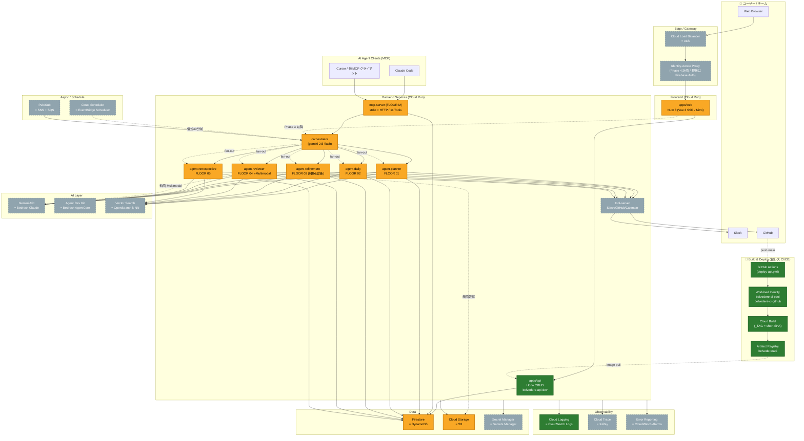
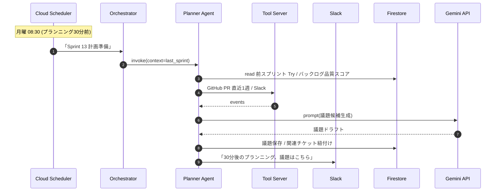

# Belvedere — Architecture

> ハッカソン必須要件: GCP実行プロダクト ≥ 1 / GCP AI技術 ≥ 1
> ユーザーはAWS実務経験あり / GCP未経験 → **GCP↔AWS の対応サービスを必ず併記**

---

## 0. 結論 (採用案)

**「Cloud Run + Gemini API + Firestore + Pub/Sub」のサーバーレス構成**を採用する。

理由:
- 必須要件 (Cloud Run + Gemini) を最小コストで満たす
- AWS Lambda / DynamoDB / SNS+SQS の感覚に近く、ユーザーが認知マッピングしやすい
- 個人参加でも回せる運用コスト
- ハッカソン審査基準⑤「拡張性・実運用への配慮」を満たす最小構成

代替案 B (GKE) / C (App Engine + Cloud Functions) は§4で比較。

---

## 1. 全体図

> **凡例 (ノードの色は実装ステータス)**
> - 🟢 **緑**: Cloud Run 上で動作確認済 (2026-05-06 API / 2026-06-08 Web 追加デプロイ)
> - 🟡 **黄**: 実装済だが Cloud Run には未 deploy (ローカル動作のみ / 空インスタンス)
> - ⚪ **灰 (破線)**: 未実装、Phase X 以降に着手予定



### 実装ステータス対応表 (2026-05-06 時点)

| ステータス | ノード | 根拠 |
|---|---|---|
| 🟢 deployed | API (`belvedere-api-dev`) | `/health` 200 確認済 (commit 4224ba6) |
| 🟢 deployed | GH / WIF / CB / AR | WIF 鍵レス CI/CD パイプライン全段動作確認済 |
| 🟢 deployed | LOG (Cloud Logging) | Cloud Run revision のログが流れている |
| 🟢 deployed | WEB (`belvedere-web-dev`) | 2026-06-08 Cloud Run 公開 (https://belvedere-web-dev-cpszmcqmuq-an.a.run.app/ 200 OK)。Mock データ表示、Firestore 接続は Phase 1-B |
| 🟡 implemented | MCP | stdio mode で 11 Tools 実装 / smoke test 14/14 / HTTP deploy は Phase 1-D |
| 🟡 implemented | ORC + 5 Agent | Python (FastAPI + ADK 雛形) / Mock LLM で動作 / Gemini 接続は Phase 3 |
| 🟡 implemented | FS | Firestore (default) instance 作成済 / データ投入は Phase 1-B |
| 🟡 implemented | GCS | Cloud Build が auto-create する `belvedere-dev-atrium_cloudbuild` bucket 存在 / Sprint Review 録画 bucket は Phase 2 |
| ⚪ planned | TOOL | Slack / GitHub Tool server (Phase 3) |
| ⚪ planned | IAP | Phase 4 (本番ドメイン取得後) |
| ⚪ planned | LB | カスタムドメイン or マルチリージョン化時 |
| ⚪ planned | GEM / ADK / VS | Phase 3 (Vertex AI 接続) |
| ⚪ planned | SM | Phase 3 (Gemini API key) |
| ⚪ planned | PUBSUB / SCHED | Phase 2 (儀式トリガ) |
| ⚪ planned | TR / ER | Phase 4 (本番監視) |

---

## 2. GCP↔AWS 対応表 (ユーザー向けチートシート)

| 役割 | GCP (採用) | AWS (既知) | 補足 |
|---|---|---|---|
| **コンテナ実行** | Cloud Run | Fargate / App Runner | Cloud RunはApp Runnerに最も近い。デプロイ1コマンド |
| **オーケストレータFn** | Cloud Run (HTTPトリガ) | Lambda + API Gateway | 関数粒度ならCloud Functions (旧2nd gen) もOK |
| **AI推論** | Gemini API / Vertex AI | Bedrock Claude / SageMaker | Gemini APIはBedrockのモデルAPI、Vertex AIはBedrock+SageMaker相当 |
| **Agent SDK** | Agent Development Kit (ADK) | Bedrock AgentCore | マルチエージェント構成のSDK |
| **NoSQL** | Firestore | DynamoDB | ドキュメント型。リアルタイム購読が標準 |
| **オブジェクト** | Cloud Storage | S3 | 概念ほぼ同じ |
| **シークレット** | Secret Manager | Secrets Manager | 名前まで同じ |
| **イベント** | Pub/Sub | SNS + SQS | Pub/SubはSNS+SQSを1つにした感じ |
| **スケジュール** | Cloud Scheduler | EventBridge Scheduler | 概念同じ |
| **CI/CD** | Cloud Build / Cloud Deploy | CodeBuild / CodeDeploy | Cloud DeployはECS Blue/Greenに近い |
| **コンテナレジストリ** | Artifact Registry | ECR | ほぼ同等 |
| **認証** | Identity Platform / Firebase Auth | Cognito | Identity PlatformはCognitoに近い、Firebase AuthはAmplify Auth |
| **ID連携(IAM Federation)** | Workload Identity Federation | IAM OIDC Provider | GitHub Actions → GCPの鍵レス連携 |
| **ログ** | Cloud Logging | CloudWatch Logs | 構造化ログのインデックス自動 |
| **トレース** | Cloud Trace | X-Ray | OpenTelemetry互換 |
| **APM** | Cloud Monitoring | CloudWatch Metrics | 同等 |
| **VPC / 専用線** | VPC + Serverless VPC Access | VPC + PrivateLink | サーバーレスからVPCに繋ぐ |
| **WAF** | Cloud Armor | WAF | DDoS / OWASPルール |
| **DNS** | Cloud DNS | Route 53 | 同等 |
| **Vector DB** | Vertex AI Vector Search | OpenSearch k-NN / Bedrock KB | Belvedere では過去ふりかえり検索に使う |

---

## 3. データフロー (Belvedere の1スプリント)



---

## 4. 採用案 vs 代替案

### 案A: Cloud Run + Gemini + Firestore (採用)

- ✅ 必須要件を最小コストで満たす
- ✅ コールドスタートあるが個人デモ規模なら問題なし
- ✅ Cloud Run (Service / Job) で同期/非同期両対応
- ✅ ローカル開発: Functions Framework / Cloud Run Local

### 案B: GKE Autopilot + Gemini

- ✅ 「拡張性」をアピールしやすい
- ❌ 個人参加でクラスタ運用は重い
- ❌ Boot Camp の例は Cloud Run + ADK が中心になる見込み

### 案C: App Engine + Cloud Functions

- ❌ App Engine は GCP 内でレガシー扱い
- ❌ デプロイ手順がCloud Runより冗長

→ **案A採用、必要に応じてGKEへの移行余地を残す（K8sマニフェストも書ける構造）**

---

## 5. リポジトリ構成 (2026-05-06 現状)

```
ai-agent-hackathon/
├── apps/
│   ├── web/              # Nuxt 3 (Vue 3 SSR / Nitro=node-server) — Cloud Run
│   ├── api/              # Hono on Cloud Run (TS) — Phase 1 で deploy
│   ├── cli/              # Mock LLM CLI demo (5 + Orchestrator ロール)
│   ├── orchestrator-py/  # FastAPI + ADK 雛形 (Python 3.11) — Phase 3 で実 Gemini 接続
│   └── mcp-server/       # MCP server (stdio Phase 0 完成 / HTTP Phase 1-D で Cloud Run)
│       └── 11 Tools: read 6 + invoke_agent 1 + CRUD 4
├── packages/
│   ├── shared/           # 型・スキーマ・定数 (Project / Ritual / ValueImpact / Epic.rationale 等)
│   ├── seed/             # 不変 demo fixture (1 project + EP-1..4 / WC-101..112 / 5 members)
│   ├── repo/             # Repository 抽象 (memory ✅ / firestore は Phase 1-B で実装)
│   ├── llm/              # LLMProvider 抽象 (mock ✅ / gemini / vertex は Phase 3 で実装)
│   ├── tools/            # buildTools(repo) factory (10 Tools + video.extractIssues)
│   └── agent/            # Agent runtime (Tool 呼び出しループ + 6 ロール prompts)
├── infra/
│   └── cloudbuild.yaml   # Cloud Build パイプライン (--allow-unauthenticated は Phase 1-A だけ)
├── .github/workflows/
│   ├── ci.yml            # TS typecheck + Python lint+type
│   └── deploy-api.yml    # WIF 経由 Cloud Run デプロイ (Phase 1 終盤で push トリガ復活)
├── docs/
│   ├── setup-gcp.md      # GCP 11 ステップ (Step 1-10 完了 / 5/6)
│   ├── setup-mcp.md      # Claude Code から MCP 接続手順
│   └── setup-github-wif.md  # WIF 設定 (Phase 1 終盤)
│   └── PROMPTING_GUIDE.md
├── memory/               # ユーザー固有記憶 (auto-load via MEMORY.md)
├── ui-mockups-v3/        # 採用 UI mockup (Hand × Digital)
├── .claude/              # rules / hooks / skills / agents (Claude Code オートメーション)
│   ├── rules/            # paths-based auto-load ルール
│   ├── hooks/            # 9 hooks (seed-guard / ts-typecheck / eraser-* / hackathon-* / usage-*)
│   ├── skills/           # 4 skills (agent-prompt-sync / eraser-arch-sync / gcp-setup / hackathon-check)
│   ├── agents/           # 4 subagents (architecture / hackathon / mock-llm / prompt-quality reviewers)
│   └── status.sh         # オートメーション可視化スクリプト
├── PRODUCT_BRIEF.md / ARCHITECTURE.md / DATA_MODEL.md / AGENT_DESIGN.md
├── ROADMAP.md / PITCH.md / PROJECT_PLAN.md / HACKATHON_COMPLIANCE.md
├── CLAUDE.md / README.md
└── package.json / pnpm-workspace.yaml / tsconfig.base.json
```

---

## 6. 環境分離

- `belvedere-dev-atrium` プロジェクト: ローカル開発+ステージング兼用 (初号機コードネーム = atrium)
- `belvedere-prod-atrium` プロジェクト: 本番 (ピッチデモ用)
- 認可: Workload Identity Federation で GitHub Actions ↔ GCP (鍵をリポジトリに置かない)

---

## 7. 観測 / コスト

- Cloud Logging: 構造化JSONログ。Trace IDをエージェント間で伝搬
- Cloud Trace: OpenTelemetryでエージェント間呼び出しを追跡
- 課金アラート: $10/月 で 50% / 90% / 100% メール通知 (Belvedere の月額想定 $5-10 にフィット、暴走早期検知)
- Gemini APIコスト: 1リクエスト100ms想定 / 1日1000リクエスト程度に収まる設計

---

## 8. セキュリティ (審査基準⑤ + WC-110対応)

- Secret Manager で API key / Slack token 管理 (リポジトリには絶対置かない)
- **Firebase Auth (個人 Google) で Web / API / MCP HTTP 認証** (`ROADMAP.md` Phase 1-B、6/9-14 着手予定 — Firestore データ層は 6/9 実装完了、認証は残作業) — IAP は本番ドメイン取得後に検討 (Phase 4)
- Firestore セキュリティルールで個人 Google アカウントだけが read/write できるよう制限 (個人参加要件のエビデンス)
- MCP HTTP は OAuth 2.1 (個人 Google アカウント、`ROADMAP.md` Phase 1-D)
- WIF (Workload Identity Federation) で GitHub Actions ↔ GCP デプロイ時の鍵レス認証 (= ユーザー認証ではなく CI 認証)
- OWASP Top 10 自動チェック (release gate, GitHub Actions、Phase 4)
- Cloud Armor で WAF (Phase 4 / 任意)
- 監査: Cloud Audit Logs を BigQuery にエクスポート (Phase 4 / 任意)

**現状 (2026-05-05)**: 認証コードは未実装 (`apps/web` / `apps/api` / `apps/mcp-server` すべて認証ミドルウェアなし)。`infra/cloudbuild.yaml` も `--allow-unauthenticated` で公開状態 = Phase 1-A の初回デプロイ専用設定。Phase 1-B 完了時点で `--no-allow-unauthenticated` + Firebase Auth 検証ミドルウェアに切替。

---

## 9. Open Questions (ユーザーに後で確認)

1. ドメイン名: belvedere.app / belvedere.dev / 取らないか
2. Slack App は本物を作るか、当面はモックのままか
3. チーム化する場合、フロントorバックどちらを任せたいか
4. ハッカソン提出時にリポジトリPublicが必須か (応募方法 Coming Soon)
