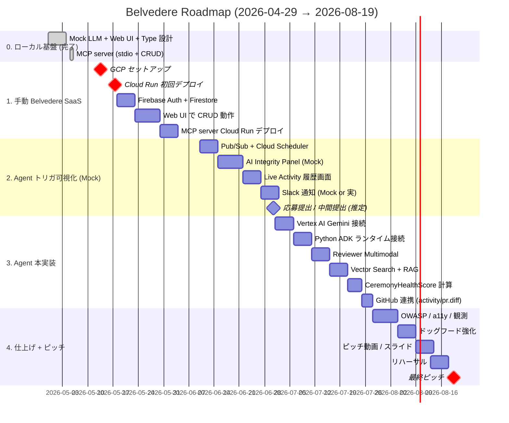

# Belvedere — Roadmap

> 起点: 2026-04-29 / ゴール: 2026-08-19 最終ピッチ in 渋谷ストリーム
> 約 16 週間 / 個人参加（チーム化は 2026-06-07 イベントで判断）
> 2026-05-05 改訂: 4 段階構成に再編 — 「**手動 SaaS → Mock Agent 可視化 → Agent 本実装 → 仕上げ**」。MCP CRUD を Phase 1 に前倒しして、Phase 2-3 の開発を Belvedere + MCP + Claude Code でドッグフードしながら回す前提に。

---

## 設計指針 (4 段階に分割した理由)

1. **Agent 開発が初経験** → まず Jira 風 SaaS を作る経験を Phase 1 で積む
2. **トリガ可視化を先に作る** → Phase 2 で「いつ AI が動くか」を Mock のまま UI に出すことで、Phase 3 で本物 LLM に置換した時に UI 体験は無変更で質だけ上がる
3. **MCP を Phase 1 に前倒し** → Phase 2-3 の開発期間中、Belvedere 自身を Belvedere + MCP + Claude Code で管理する究極のドッグフード
4. **MVP のたたき台を早く出す** → Phase 1 完了 (6/9) で動く SaaS が手に入る → 中間提出にも耐える

---

## ガントチャート (Mermaid)

---

## マイルストーン

### Phase 0 / 4/29 〜 5/12 — **「ローカル基盤」** ✅ 完了

ゴール: GCP 接続なしで `pnpm dev` から Mock LLM + Web UI + MCP まで動く状態。

- [x] UI スタディ → Claude Design に切替 (5/3)
- [x] PRODUCT_BRIEF / ARCHITECTURE / DATA_MODEL / AGENT_DESIGN / PITCH 確定 (5 儀式 + Project + valueImpact + ReviewRecording + Epic.rationale)
- [x] monorepo scaffold (TypeScript pnpm workspace 11 packages + Python uv)
- [x] LLM プロバイダ抽象 (mock 実装 / gemini / vertex は throw)
- [x] Mock Agent runtime (Tool 呼び出しループ + 6 ロール)
- [x] Web UI 最小版 (Nuxt 3 + Vue 3 SSR / Claude Design 由来 5 画面 + AI Panel)
- [x] git init + 個人 GitHub push (KaedeAatou/belvedere private)
- [x] Eraser アーキ図 + 自動同期 hook
- [x] **MCP server (stdio mode / 11 Tools)**: 読み取り 6 + invoke_agent + **CRUD 4 本実装** (前倒し)。Smoke test **14/14 pass**

### Phase 1 / 5/13 〜 6/9 — **「手動 Belvedere SaaS」** 🟡 これから

ゴール: **Agent なしの Jira 風 SaaS** が Cloud Run で動く。Web UI で人間がチケット起票・編集・進捗変更ができる。MCP も Cloud Run 上にホストされ、Claude Code から本番 Belvedere を操作できる = ここから自分が Belvedere の最初のヘビーユーザーに。

#### Phase 1-A: GCP 基盤 (5/13-17 → ✅ 完了 2026-05-06)
- [x] **GCP セットアップ** (個人 `owner@example.com` / `belvedere-dev-atrium` + `belvedere-prod-atrium` / API 14 個有効化 / Firestore Native asia-northeast1 / Artifact Registry "belvedere" / Service Account `belvedere-runtime` + 9 ロール / 課金アラート $10/月)
- [x] **WIF (Workload Identity Federation) セットアップ**: `belvedere-ci-pool` + `belvedere-ci-github` Provider + `belvedere-deployer` SA (6 ロール) + principalSet で `KaedeAatou/belvedere` repo に絞込。GCP リソース命名は `belvedere-` プレフィックスで統一 (旧 `github-actions` / `github-pool` / `github-provider` は完全削除)
- [x] `.github/workflows/deploy-api.yml` 修正完了: `WIF_PROVIDER` 実値置換 (`876087923874` / `belvedere-ci-pool` / `belvedere-ci-github`) + push トリガ復活 (paths 限定) + `_TAG` substitution で SHORT_SHA を image tag に
- [x] **Cloud Run 初回デプロイ完了** (2026-05-06): `https://belvedere-api-dev-cpszmcqmuq-an.a.run.app/health` で 200 OK + `{"status":"ok","llm":"mock","repo":"memory"}` 確認済。Web (Nuxt 3) のデプロイは Phase 1-C で対応
- [x] Cloud Build → Cloud Run CI (WIF 経由) 動作確認済 (commit 4224ba6 で完全グリーン / 2m42s)
- [ ] Secret Manager セットアップ (Phase 3 の Gemini key 用に枠だけ用意)

#### Phase 1-B: データ層 + 認証 (5/18-22)
- [ ] **Firestore データ層** (`packages/repo/src/firestore.ts` 実装、現状 throw)
- [ ] Firestore セキュリティルール (個人 Google アカウントだけ read/write)
- [ ] **Firebase Auth (個人 Google)** で UI / API / MCP を保護
- [ ] seed の Firestore 投入スクリプト

#### Phase 1-C: Web UI で CRUD 動作 (5/23-29)
- [ ] チケット詳細画面で **編集 / status 変更 / Epic 紐付け / SP 設定** が UI でできる
- [ ] バックログから新規チケット起票
- [ ] Sprint 切替 / Epic 一覧 / メンバ表示
- [ ] AI Integrity Panel は **空の枠だけ** (Phase 2 で中身を流し込む準備)

#### Phase 1-D: MCP を Cloud Run へ (5/30-6/3)
- [ ] **MCP server を Cloud Run にデプロイ** (HTTP / Streamable HTTP transport 追加、stdio と両対応)
- [ ] OAuth 2.1 認証 (個人 Google アカウント) で MCP HTTP を保護
- [ ] Claude Code から本番 Belvedere の MCP に接続 → CRUD 操作の実利用開始
- [ ] **「Belvedere 自身の開発を Belvedere + MCP + Claude Code で管理する」ドッグフード開始**

#### Phase 1-E: ピッチデモ動画 (5/30-6/9)
- [ ] **ピッチデモ動画 1 本** (5/末まで、Mock UI でも撮れる範囲で)
- [ ] 6/9 友人 2-3 人にデモして反応を取る

検証イベント: **2026-06-09** (Boot Camp 開始日まで)。中間提出があれば Phase 1 完成版で勝負。

---

### Phase 2 / 6/10 〜 6/30 — **「Agent トリガ可視化 (Mock)」**

ゴール: 「**いつ AI が動くか**」が UI で見える。Agent 中身は Mock のままだが、Pub/Sub / Cloud Scheduler / AI Panel / Live Activity の **配線がすべて完成** していて、Phase 3 で本物 Gemini に差し替えれば即動く状態。

- [ ] **Pub/Sub トピック設計**: `ticket.created` / `ceremony.upcoming` / `try.persisted` / `review_recording.uploaded`
- [ ] **チケット保存 → Pub/Sub publish → Mock Agent runtime 起動** (チケット詳細画面で「AI が診断中...」表示)
- [ ] **AI Integrity Panel が Mock 応答を即時表示** (現在の `packages/llm/src/mock.ts` 出力を JSON で受けて UI レンダリング)
- [ ] **Live Activity 画面**: Agent 起動履歴一覧 (`AgentRun` レコードを Firestore から)
- [ ] **Cloud Scheduler 設定**: 月曜 08:30 (Planner) / 平日 09:55 (Daily) / 木曜 14:30 (Refinement) / レビュー前日 17:00 (Reviewer) / ふりかえり当日 16:00 (Retro)
- [ ] **Slack Bot Mock** (or 実 Slack に投稿) — Daily / Planner の通知を可視化
- [ ] 5 画面それぞれで Mock Agent パネルが稼働 (Planning / Daily / Refinement / Review / Retro)
- [ ] 応募提出 / 中間提出 (フォーム公開後すぐ)

検証イベント: 2026-06-30 までに「ユーザーが何もしなくても Slack に Agent 通知が届く」演出が成立。ピッチデモ動画もこの時点で撮り直し可能。

---

### Phase 3 / 7/1 〜 7/27 — **「Agent 本実装」**

ゴール: Mock LLM を本物 Gemini に差し替え、Multimodal / RAG / マルチエージェントが本気で動く。

- [ ] **Vertex AI Gemini 接続** (`packages/llm/src/gemini.ts` 実装) — `LLM_PROVIDER=gemini` に切替で Phase 2 の枠に本物応答が流れ込む
- [ ] **Python ADK ランタイム接続** (`USE_REAL_ADK=true` 経路実装、`apps/orchestrator-py/src/orchestrator/agents.py`)
- [ ] **Reviewer Multimodal**: Sprint Review 録画 → 指摘抽出 → Ticket 起票候補 (Gemini 2.5 Pro Vision + Cloud Storage + `video.extractIssues` 本実装)
- [ ] **Vector Search + RAG Engine**: 過去 Try / Scrum Guide を Refinement / Retrospective が参照
- [ ] **CeremonyHealthScore 計算** (出席率 / onTime / actionableOutputs / qualityRate を 4 軸で実計算)
- [ ] **ユーザー GitHub 連携**: `github.activity` (Daily の停滞検出強化) / `github.pr.diff` (Reviewer のデモシナリオ補強)
- [ ] **エージェント間メッセージング** (A2A) — Orchestrator から各 Agent への fan-out
- [ ] prompts.ts の XML 構造化 + Few-shot 例追加 (`docs/PROMPTING_GUIDE.md` 準拠)

検証イベント: 2026-07-27 までに「動画から指摘抽出 → チケット起票」が本物で動くデモが撮れる。

---

### Phase 4 / 7/28 〜 8/19 — **「仕上げ + ピッチ」**

- [ ] OWASP リリースゲート (Cloud Build に組込み)
- [ ] a11y 監査 (5 画面 / WCAG AA)
- [ ] Cloud Logging + Cloud Trace でコスト・レイテンシ監視
- [ ] パフォーマンスチューニング (Mock LLM → 本物 Gemini への置換でレイテンシ増を吸収)
- [ ] ドッグフード強化 (自分以外の友人 2-3 人にも触ってもらい、UX 修正)
- [ ] **ピッチ動画 (3 分)** + スライド (10 枚以内)
- [ ] デモシナリオ確定 (90 秒で価値が伝わる流れ — `PITCH.md §4`)
- [ ] リハーサル ×3 (8/13-)
- [ ] 最終ピッチ in 渋谷ストリーム (8/19)

---

## 週次の作業リズム (推奨)

- 月: 計画 / 先週ふりかえり (Belvedere + MCP + Claude Code で実施 = ドッグフード)
- 火-木: 実装
- 金: 統合 / デプロイ / ドッグフード
- 土: 文書整理 / ピッチ素材
- 日: 休息

---

## 中止・縮退の判断ポイント

| 期限 | 条件 | 縮退案 |
|---|---|---|
| **2026-05-17** | Cloud Run /health 200 が出ない | アーキを Cloud Functions 一本に縮退 |
| **2026-06-09** | 手動 SaaS で Web UI CRUD が動かない | チケット起票だけに絞り、編集機能は Phase 2 へ |
| **2026-06-30** | Pub/Sub + Cloud Scheduler + Mock 配線が完成しない | Phase 3 で Gemini 接続を諦め、Mock のままピッチで「**配線は出来ている、本物は将来差し替え**」と説明する切り替え |
| **2026-07-27** | Reviewer Multimodal が動かない | 動画 → チケットデモは録画 (Mock) に差し替え、Multimodal は質疑で説明 |
| **2026-08-04** | **無料トライアル終了 (リソース停止リスク)** | (a) ハッカソンクーポン $300 を受領済なら billing に追加、(b) 7/末までに「フルアカウント有効化」を実施して請求モードに切替 (Belvedere 規模で月 $5-10 程度) |

---

## 個人参加 vs チーム化

- 個人で完走できる規模感ではない (Phase 3 + Phase 4 が時間勝負)
- 6/7 のチームビルディングで、**フロント 1 人 / DevOps 1 人**が見つかれば楽
- それまでは Claude (= 私) が全担当 + Belvedere + MCP + Claude Code を駆使してドッグフード
- ボトルネックは「ユーザーが GCP 操作する時間」と「個人の睡眠時間」のみ
