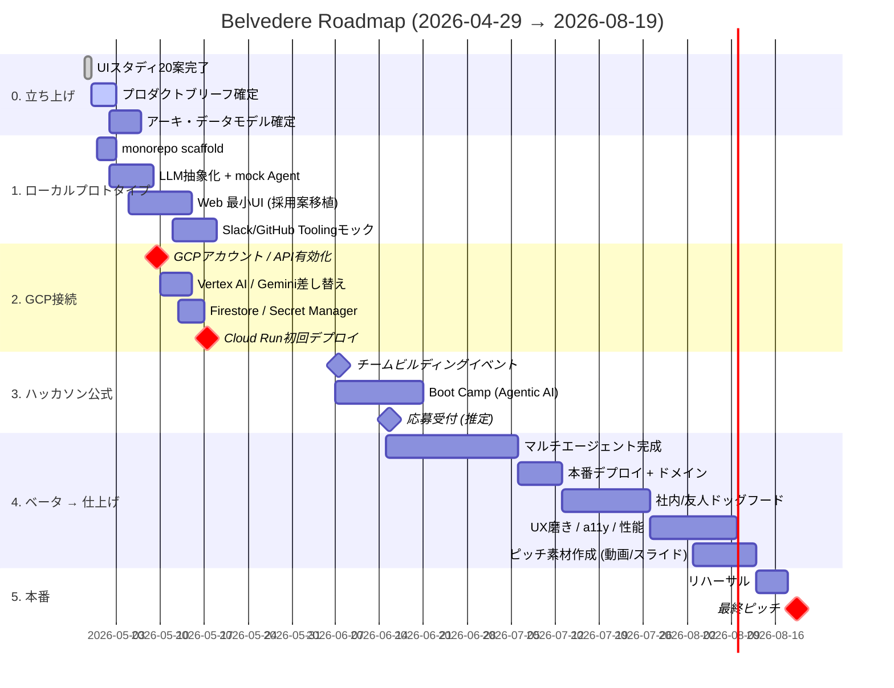

# Belvedere — Roadmap

> 起点: 2026-04-29 (今日) / ゴール: 2026-08-19 最終ピッチ in 渋谷ストリーム
> 約 16 週間 / 個人参加（チーム化は2026-06-07イベントで判断）

---

## ガントチャート (Mermaid)

---

## マイルストーン (4週間 = 1フェーズ で区切る)

### Phase 0 / 4/29 〜 5/12 — **「ローカルでエージェントが動く」** ✅ ほぼ完了 (2026-05-04)

ゴール: GCPアカウントが無くても、`pnpm dev` で起動して mock LLM でエージェントが動作する状態。

- [x] UI スタディ (4/28-30、Claude Design に切替 5/3)
- [x] PRODUCT_BRIEF / ARCHITECTURE / DATA_MODEL / AGENT_DESIGN 確定 (Belvedere 化 + Refinement Agent + Project エンティティ + valueImpact 反映済 / 2026-05-04)
- [x] monorepo scaffold (TypeScript pnpm workspace 9 packages + Python uv)
- [x] LLM プロバイダ抽象 (mock 実装 / gemini / vertex は GCP 接続待ちで throw)
- [x] Mock Agent runtime (Tool呼び出しループ + 5 ロール + Orchestrator)
- [x] Web UI 最小版 (Nuxt 3 + Vue 3 SSR / Claude Design 由来 5 画面 + AI Panel + Detail Sheet 完成)
- [x] git init + 個人 GitHub push (KaedeAatou/belvedere private)
- [x] Eraser アーキ図 + 自動同期 hook
- [ ] Slack / GitHub のローカルモック (Phase 1 と並行)

検証イベント: 5/10 自分で1回スプリントを回してドッグフード

### Phase 1 / 5/13 〜 6/9 — **「GCPと繋がる」** 🟡 着手目前 (Phase 1 期限 5/17、残 13 日)

ゴール: Cloud Run にデプロイ済み、Vertex AI 経由で実 Gemini が動く。Boot Camp 開始までに最小デモ可能。

- [ ] **GCP セットアップ** (個人アカウント `owner@example.com` でプロジェクト作成 / API 有効化 / SA) ← **ユーザー必須作業 / 5/7 の 300 ドルクーポン受領後**
- [ ] **`.github/workflows/deploy-api.yml` の 2 点修正** (GCP セットアップ完了後に 1 回だけ): (a) `on:` に `push: branches: [main]` を戻す / (b) `WIF_PROVIDER` 内 `PROJECT_NUMBER` を実プロジェクト番号に置換
- [ ] **Cloud Run 初回デプロイ** (Mock LLM のままでも 5/17 までに `/health` 200) ← Phase 1 ハードル
- [ ] Vertex AI / Gemini API 接続 (`packages/llm/src/gemini.ts` 実装、現状 throw)
- [ ] Python 側 `USE_REAL_ADK=true` 経路実装 (`apps/orchestrator-py/src/orchestrator/agents.py`)
- [ ] Firestore データ層 (`packages/repo/src/firestore.ts` 実装、現状 throw)
- [ ] Cloud Build → Cloud Run CI (WIF 経由、`KaedeAatou/belvedere` から)
- [ ] Secret Manager で Gemini API key 管理
- [ ] **ピッチデモ動画 1本** (5/末まで、Mock LLM ベースで OK)
- [ ] (任意) Slack App 本物化
- [ ] Boot Camp 参加 (6/7〜)

検証イベント: 6/9 友人2-3人にデモして反応を取る

### Phase 2 / 6/10 〜 7/6 — **「マルチエージェント本領発揮」**

ゴール: 5儀式を別エージェント (Refinement含む)が担当する構成 (ADK)、オーケストレータで統合。

- [ ] ADK でマルチエージェント実装 (Planner / Daily / Refinement / Reviewer / Retrospective)
- [ ] エージェント間メッセージング (Pub/Sub)
- [ ] CeremonyHealthScore 計算ロジック (出席率 / onTime / actionableOutputs / qualityRate)
- [ ] 儀式別画面 5枚 (Planning / Daily / Refinement / Review / Retrospective)
- [ ] 形骸化検出ルール (差別化ポイント — `priority×valueImpact` ミスマッチ / DoD空 / Try未消化 など)
- [ ] 応募提出（フォーム公開後すぐ）

### Phase 3 / 7/7 〜 8/3 — **「本番品質」**

- [ ] 本番ドメイン / TLS
- [ ] 認証 (Firebase Auth or IAP)
- [ ] 観測 (Cloud Logging / Trace) + コスト監視
- [ ] ドッグフード (社内 / 友人) / ユーザビリティ修正
- [ ] パフォーマンス / a11y
- [ ] セキュリティレビュー (OWASP Top 10)

### Phase 4 / 8/4 〜 8/19 — **「伝える」**

- [ ] ピッチ動画撮影 (3分)
- [ ] スライド作成 (10枚以内)
- [ ] デモシナリオ確定 (90秒で価値が伝わる流れ)
- [ ] リハーサル ×3
- [ ] 最終ピッチ in 渋谷ストリーム

---

## 週次の作業リズム (推奨)

- 月: 計画 / 先週ふりかえり (←自分で回す)
- 火-木: 実装
- 金: 統合 / デプロイ / ドッグフード
- 土: 文書整理 / ピッチ素材
- 日: 休息 (持続可能な開発のため)

---

## 中止・縮退の判断ポイント

- 5/17までに Cloud Run にデプロイできていない → アーキを Cloud Functions 一本に縮退
- 6/9 までにマルチエージェントの設計が固まらない → シングルエージェントで全儀式を回す簡易版に切り替え
- 7/6 までに認証設計が決まらない → ピッチデモは認証なしのモック環境で行う割り切り

---

## 個人参加 vs チーム化

- 個人で完走できる規模感ではない (8月までに4エージェント + DevOps + Web が間に合いにくい)
- 6/7 のチームビルディングイベントで、フロント1人 / DevOps1人を見つけられると楽
- それまではClaude(自分)が全担当のつもりで進める = ボトルネックは「ユーザーがGCP操作する時間」のみ
